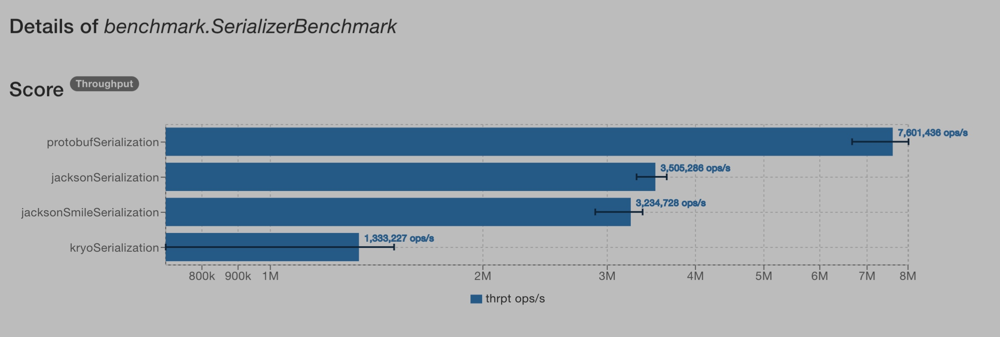
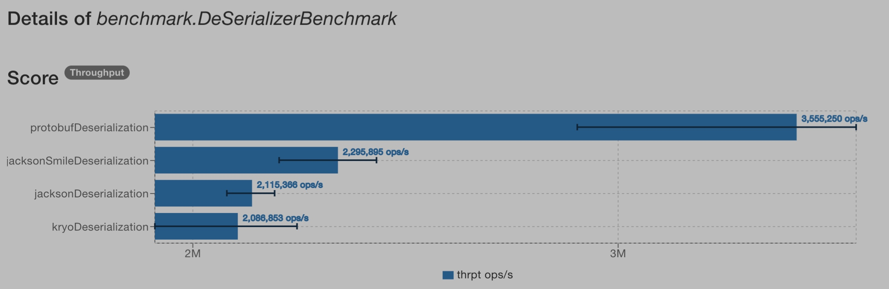

### Benchmarking few Serialization libraries

This project benchmarks few popular serialization libraries for throughput in JVM

#### Libraries benchmarked

*   [Jackson](https://github.com/FasterXML/jackson-databind)
*   [Jackson with Smile](https://github.com/FasterXML/jackson-dataformats-binary/tree/master/smile)
*   [Kryo](https://github.com/EsotericSoftware/kryo)
*   [Protobuf](https://github.com/protocolbuffers/protobuf)

#### Benchmarked for

*   **Serialization**: Object => byte[]
*   **Deserialization**: byte[] => Object

> Note: The output and input are either the object to be serialized or the serialized byte array and not Strings.


#### Results

###### Serialization

```
Benchmark                               Mode  Cnt        Score        Error  Units
Benchmark.jacksonSerialization         thrpt   25  3505286.029 ±  60946.779  ops/s
Benchmark.protobufSerialization        thrpt   25  7601436.403 ± 232750.640  ops/s
Benchmark.jacksonSmileSerialization    thrpt   25  3234728.097 ±  93584.220  ops/s
Benchmark.kryoSerialization            thrpt   25  1333227.049 ± 165123.056  ops/s
```



###### Deserialization

```
Benchmark                               Mode  Cnt        Score        Error  Units
Benchmark.jacksonDeserialization         thrpt   25  2115366.130 ±  20036.740  ops/s
Benchmark.protobufDeserialization        thrpt   25  3555250.236 ± 136427.786  ops/s
Benchmark.jacksonSmileDeserialization    thrpt   25  2295894.634 ±  44186.782  ops/s
Benchmark.kryoDeserialization            thrpt   25  2086853.436 ±  58593.784  ops/s
```



**For more analysis go [here](http://jmh.morethan.io/?source=https://gist.githubusercontent.com/hariharanv01/ccd5e40bf0eea9ab0f9baf16149f8749/raw/26feb5cf0687ec39483faef95aa88e1289a6fb4c/jmh-result.json)

#### Test settings

**Hardware/OS**
MacOS Sierra 10.12.6
2.5 GHz Intel Core i7
16 GB 2133 MHz LPDDR3

**JVM**
java version "1.8.0_181"
Java(TM) SE Runtime Environment (build 1.8.0_181-b13)
Java HotSpot(TM) 64-Bit Server VM (build 25.181-b13, mixed mode)

**Assumptions**
The objects and the byte array that are to be serialized/deserialized are cached. So, if any library maintains any sort of cache that might impact the numbers.

**Input**

```java
// A representation of the below
Employee(1, "Once", System.currentTimeMillis(),
            new ArrayList<>(Arrays.asList("D1", "D2", "D3")))
```


#### Conclusion

As can be seen from the numbers, Protobuf performed the best as expected. Jackson performed better than Jackson with Smile for serialization, and the other way around for deserialization. The biggest surprise was Kryo. It performed the worst in both the categories (and worse by a huge margin for serialization).

Take these numbers with a grain of salt. These numbers are for the specified input. The performance might vary as the characteristics of the input changes e.g. size of the input, type of the properties, caching, etc.  
